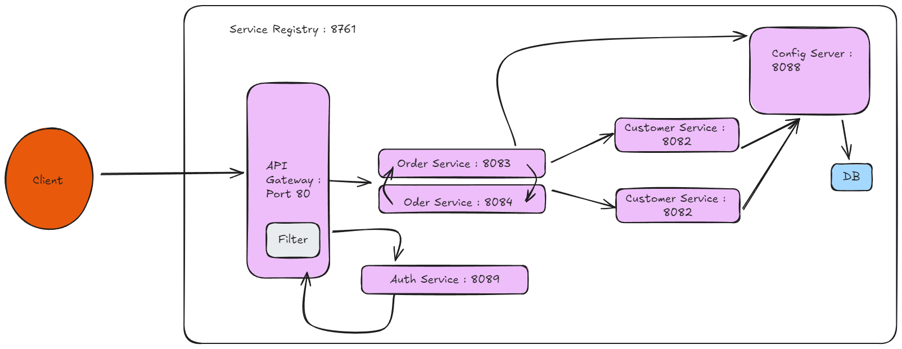

# Microservice dengan JWT
java 17, spring-boot 3..

dependencies customer-service:
Spring Web,
MySQL driver,
Spring Data JPA,
Lombok,
Spring Boot DevTools,
Eureka Discovery Client,
Config Client,
Spring Boot Actuator,
zipkin,

dependencies product-service:
Spring Web,
MySQL driver,
Spring Data JPA,
Lombok,
Spring Boot DevTools,
Eureka Discovery Client,
Config Client,
Spring Boot Actuator,
Zipkin,

dependencies order-service(RestTemplate):
Spring Web,
MySQL driver,
Spring Data JPA,
Lombok,
Spring Boot DevTools,
Eureka Discovery Client,
Config Client,
Spring Boot Actuator,
zipkin,

dependencies order-service-new:
Spring Web,
MySQL driver,
Spring Data JPA,
Lombok,
Spring Boot DevTools,
Eureka Discovery Client,
Spring Reactive Web,
Config Client,
Spring Boot Actuator,
zipkin,

dependencies Service Registry:
Eureka Server,
Spring Web,

dependencies Api Gateway:
Eureka Discovery Client,
Spring Web,
Gateway,
Zipkin,

dependencies Config Server:
Config Server,

Command:
java -jar zipkin-server-3.4.1-exec.jar,
mvn spring-boot:run